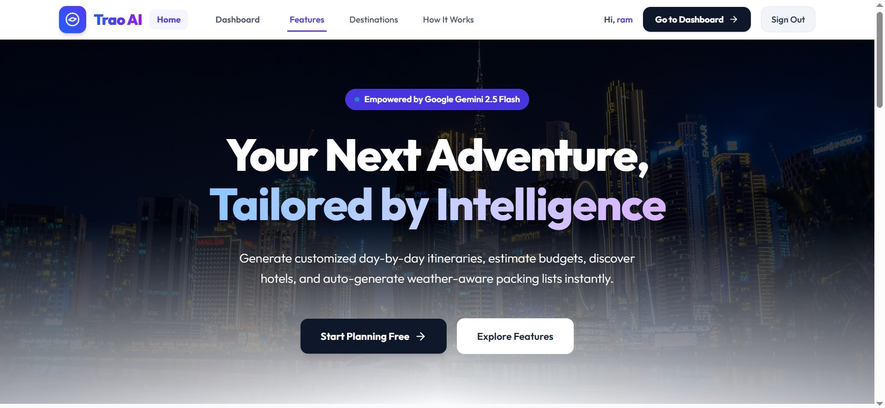
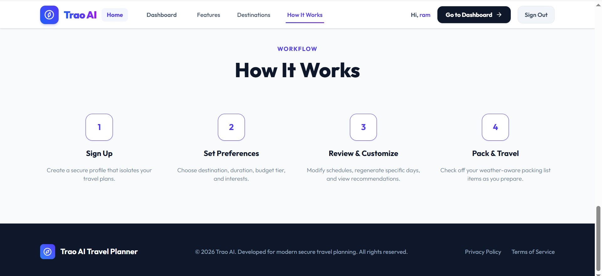
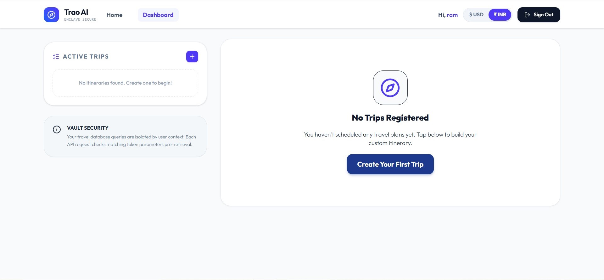
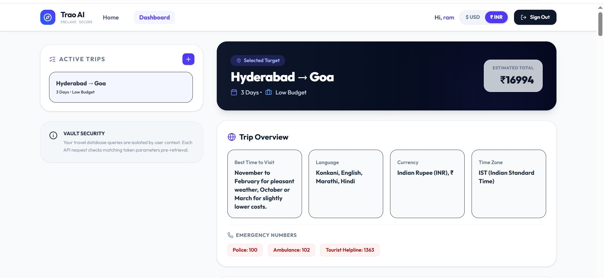

# 🧭 Trao AI Travel Planner

> AI-powered travel planning application — Generate personalized day-by-day itineraries, estimate budgets, discover hotels, and auto-generate weather-aware packing lists instantly.

   

---

## 📋 Table of Contents

- [Overview](#overview)
- [Features](#features)
- [Tech Stack](#tech-stack)
- [Project Structure](#project-structure)
- [Getting Started](#getting-started)
- [Environment Variables](#environment-variables)
- [API Reference](#api-reference)
- [Screenshots](#screenshots)
- [Future Enhancements](#future-enhancements)

---

## Overview

**Trao AI Travel Planner** is a full-stack web application that helps users plan complete trips using artificial intelligence. Users register, log in, and generate rich travel plans powered by **Google Gemini 2.5 Flash**. The app supports USD/INR currency conversion, responsive navigation, secure JWT authentication, and gracefully falls back to mock data when the Gemini API key is not configured.

| Part     | Stack                          | Default URL           |
|----------|--------------------------------|-----------------------|
| Frontend | React 19 + Vite + Tailwind CSS | http://localhost:5173 |
| Backend  | Node.js + Express + MongoDB    | http://localhost:5000 |

---

## Features

### 🔐 User Authentication
- Register with name, email, and password
- Login with JWT tokens (valid 7 days)
- Passwords hashed with bcrypt
- Protected routes — redirects to login if no token

### 🤖 AI Trip Generation (Google Gemini 2.5 Flash)
- Enter: departure city, destination, duration, budget tier, interests, travel type, and number of travelers
- AI generates a complete travel plan including:
  - Day-by-day itinerary with morning / afternoon / evening activities
  - Meal recommendations with restaurant names and must-try dishes
  - Hotel and accommodation suggestions
  - Transportation options (flights, trains, local transport)
  - Daily and total budget breakdown
  - Weather-aware packing list
  - Cultural, safety, food, and health tips
  - Nearby attractions for day trips
  - Emergency contact numbers

### 📅 Trip Management
- View all saved trips in sidebar
- Create, update, and delete trips
- Add custom activities to any day
- Regenerate a specific day with custom AI instructions
- Toggle packing list items (packed / unpacked)

### 💱 Currency Conversion (USD / INR)
- Toggle between $ USD and ₹ INR anywhere in the dashboard
- Live exchange rate fetched at trip creation via ExchangeRate API
- Preference saved in localStorage

### 📱 Fully Responsive
- Desktop: full sidebar layout
- Mobile: hamburger menu, trip drawer, username visible in top bar
- Smooth animations and transitions throughout

---

## Tech Stack

### Frontend
- **React 19** — UI library
- **Vite** — Build tool and dev server
- **React Router DOM 7** — Client-side routing
- **Tailwind CSS 4** — Utility-first styling
- **Lucide React** — Icons

### Backend
- **Node.js + Express 4** — REST API server
- **MongoDB + Mongoose 8** — Database and ODM
- **bcryptjs** — Password hashing
- **jsonwebtoken** — Authentication tokens
- **dotenv** — Environment variables
- **cors** — Cross-origin requests
- **nodemon** — Dev auto-restart

### External Services
- **Google Gemini API** — AI trip generation
- **ExchangeRate API** — Live USD → INR conversion
- **Google Maps** — Activity location links

---

## Project Structure

```
TraoAITravelPlanner/
├── assets/
│   ├── favicon.png                # App icon
│   ├── TravelApp1.jpg             # Screenshot - Home page
│   ├── TravelApp2.jpg             # Screenshot - Dashboard
│   ├── TravelApp3.jpg             # Screenshot - Trip details
│   └── TravelApp4.jpg             # Screenshot - Create trip / mobile
├── backend/
│   ├── config/
│   │   └── db.js                  # MongoDB connection
│   ├── controllers/
│   │   ├── authController.js      # Register, login, profile
│   │   └── tripController.js      # Trip CRUD + AI generation
│   ├── middleware/
│   │   └── auth.js                # JWT verification middleware
│   ├── models/
│   │   ├── User.js                # User schema
│   │   └── Trip.js                # Trip schema
│   ├── routes/
│   │   ├── authRoutes.js          # /api/auth/*
│   │   └── tripRoutes.js          # /api/trips/*
│   ├── .env                       # Secrets (not committed)
│   ├── .env.example               # Environment template
│   └── server.js                  # Express entry point
│
└── frontend/
    └── src/
        ├── components/
        │   ├── LandingPage.jsx        # Home / marketing page
        │   ├── LandingNavbar.jsx      # Landing page navbar
        │   ├── Login.jsx              # Login form
        │   ├── Register.jsx           # Registration form
        │   ├── Dashboard.jsx          # Main trip planner UI
        │   ├── Navbar.jsx             # Dashboard navbar
        │   ├── NavUserGreeting.jsx    # "Hi, Username" component
        │   ├── CreateTripForm.jsx     # Multi-step trip creation modal
        │   └── CurrencyToggle.jsx     # USD/INR toggle + useCurrency hook
        ├── App.jsx                    # Routes definition
        ├── main.jsx                   # React entry point
        └── index.css                  # Global styles + animations
```

---

## Getting Started

### Prerequisites
- Node.js v18 or higher
- MongoDB (local or MongoDB Atlas cloud)
- Google Gemini API key (optional — app uses mock data if missing)

### 1. Clone the repository

```bash
git clone https://github.com/virendrasahu/AI-Travel-Planner.git
cd AI-Travel-Planner
```

### 2. Setup Backend

```bash
cd backend
npm install
cp .env.example .env
# Fill in your values in .env
npm run dev
```

Backend starts at **http://localhost:5000**

### 3. Setup Frontend

```bash
cd frontend
npm install
npm run dev
```

Frontend starts at **http://localhost:5173**

---

## Environment Variables

### Backend (`backend/.env`)

```env
PORT=5000
MONGO_URI=mongodb+srv://<username>:<password>@cluster.mongodb.net/trao-travel
JWT_SECRET=your_super_secure_random_secret_key
GEMINI_API_KEY=your_google_gemini_api_key
```

| Variable       | Required | Description                                        |
|----------------|----------|----------------------------------------------------|
| PORT           | No       | Server port (default: 5000)                        |
| MONGO_URI      | Yes      | MongoDB connection string                          |
| JWT_SECRET     | Yes      | Secret for signing JWT tokens                      |
| GEMINI_API_KEY | No       | Gemini API key (mock data used if not provided)    |

### Frontend (`frontend/.env`)

```env
VITE_API_URL=http://localhost:5000
```

> For production, set `VITE_API_URL` to your deployed backend URL.

---

## API Reference

Base URL: `http://localhost:5000`

### Health Check
```
GET /health
```

### Authentication

| Method | Endpoint         | Auth | Description          |
|--------|------------------|------|----------------------|
| POST   | /api/auth/register | No | Create new account   |
| POST   | /api/auth/login    | No | Login, receive JWT   |
| GET    | /api/auth/me       | Yes | Get user profile     |

### Trips (all require `Authorization: Bearer <token>`)

| Method | Endpoint                    | Description                    |
|--------|-----------------------------|--------------------------------|
| POST   | /api/trips                  | Generate and save a new trip   |
| GET    | /api/trips                  | Get all trips for current user |
| GET    | /api/trips/:id              | Get a single trip              |
| PUT    | /api/trips/:id              | Update trip fields             |
| DELETE | /api/trips/:id              | Delete a trip                  |
| POST   | /api/trips/:id/regenerate-day | Regenerate one day with AI   |

#### Create Trip — Request Body
```json
{
  "from": "Mumbai",
  "destination": "Goa",
  "durationDays": 3,
  "budgetTier": "Medium",
  "interests": ["Beach", "Food & Dining", "Nightlife"],
  "travelType": "friends",
  "travelers": 4
}
```

#### Regenerate Day — Request Body
```json
{
  "dayNumber": 2,
  "prompt": "Make it more beach-focused with water sports"
}
```

---

## Deployment

### Backend — Render.com
1. Push backend to GitHub
2. Create a new Web Service on [render.com](https://render.com)
3. Set environment variables in Render dashboard:
   - `MONGO_URI`, `JWT_SECRET`, `GEMINI_API_KEY`, `PORT=5000`
4. Deploy

### Frontend — Vercel
1. Push frontend to GitHub
2. Import project on [vercel.com](https://vercel.com)
3. Set environment variable:
   - `VITE_API_URL=https://your-backend.onrender.com`
4. Deploy

---

## Screenshots

App previews of **Trao AI Travel Planner** across key screens.

### Home Page

<p align="center">
  
</p>
<p align="center"><em>Landing page with hero section, features overview, and navigation</em></p>

### Dashboard

<p align="center">
  
</p>
<p align="center"><em>Trip dashboard with saved trips sidebar and trip overview</em></p>

### Trip Details

<p align="center">
  
</p>
<p align="center"><em>AI-generated itinerary, budget breakdown, and day-by-day activities</em></p>

### Create Trip & Mobile View

<p align="center">
  
</p>
<p align="center"><em>Create trip form with travel preferences and responsive mobile layout</em></p>

---

## Local Storage Keys

| Key             | Values      | Purpose                    |
|-----------------|-------------|----------------------------|
| `token`         | JWT string  | Authentication             |
| `userName`      | String      | Display name in navbar     |
| `trao_currency` | USD / INR   | Currency preference        |

---

## Future Enhancements

- 🗺️ Embedded map view for itinerary activities (Leaflet.js)
- 📄 Export trip as PDF or shareable public link
- 🌦️ Real-time weather API integration for packing suggestions
- 🌙 Dark mode toggle
- 👥 Trip collaboration — share with friends
- 🔑 Forgot password / password reset
- ✏️ Profile edit page
- 🌐 Multi-language support

---

## Security

- Passwords are never stored in plain text (bcrypt, 10 salt rounds)
- JWT tokens expire after 7 days
- All trip endpoints verify `userId` matches token owner
- `.env` file is gitignored and never committed
- CORS configured for frontend-backend communication

---

## License

This project is for educational and personal use.

---

**Built with ❤️ using React, Node.js, and Google Gemini AI**